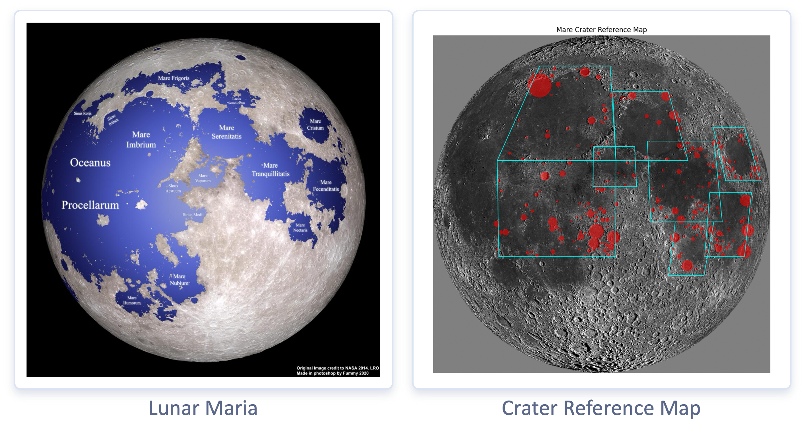
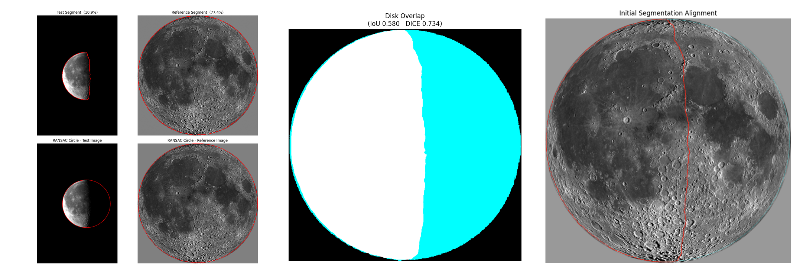
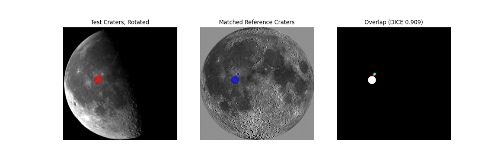
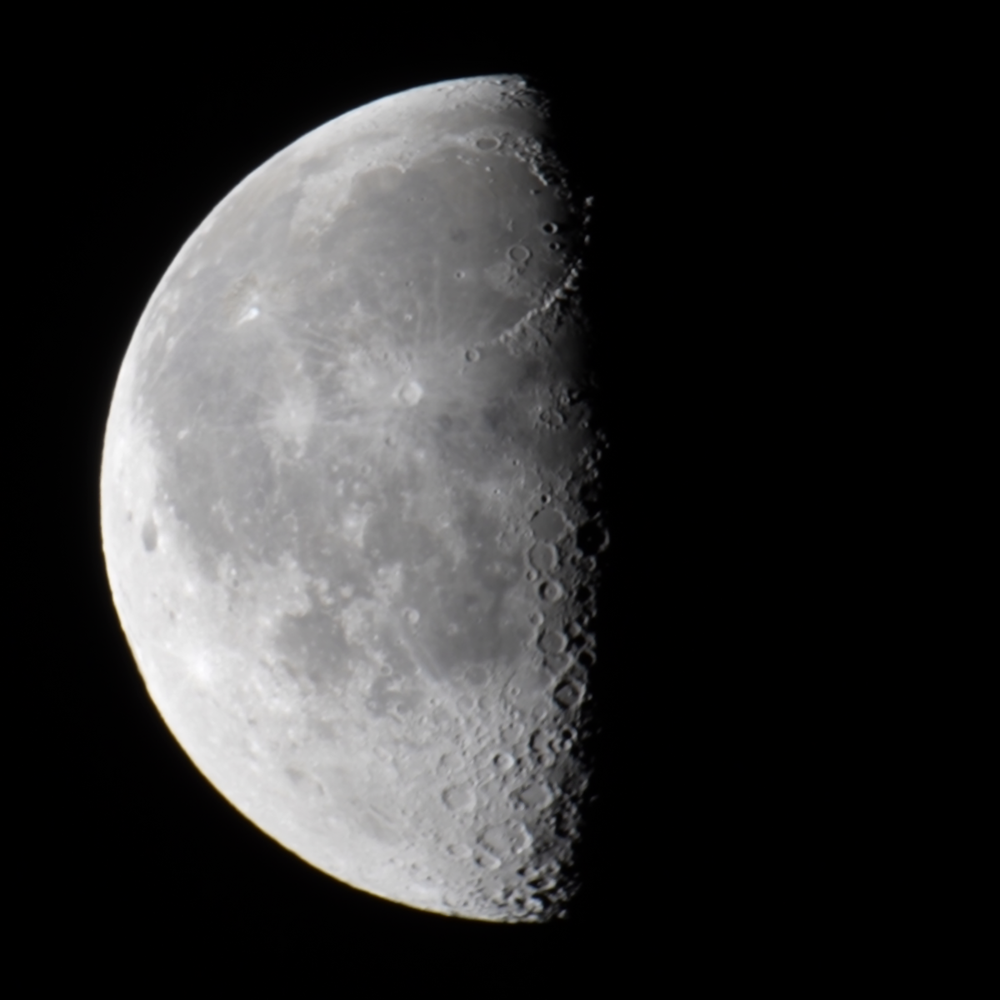
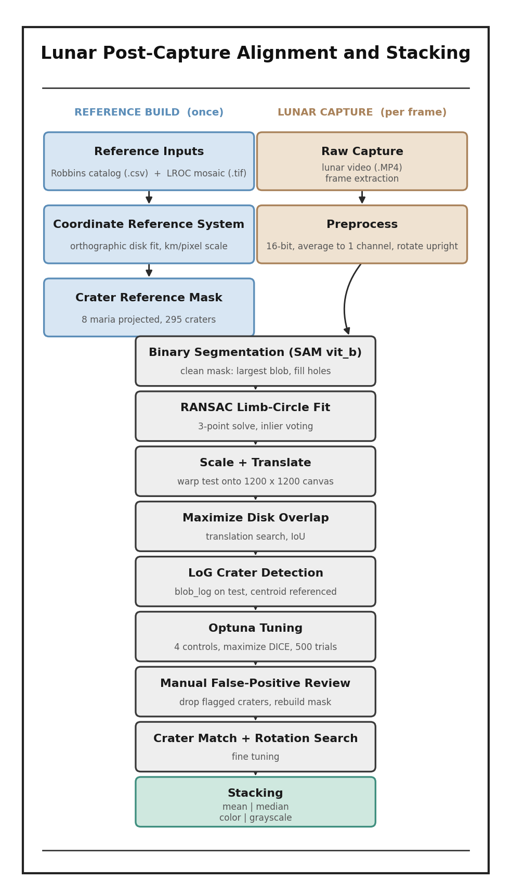

# Lunar Post-Capture Alignment and Stacking
## An Earth-Based Computer Vision Approach

## Introduction
This project innovates in its approach to lunar astrophotography through advanced computer vision techniques. Its objective is to process video frames into an ultra-sharp image of the Moon, utilizing a custom crater reference map and lucky imaging. Alignment and crater detection tuning are applied automatically, but can be customized as needed. The final image is fully based on the provided video frames; no part of the final image is AI-generated.
  

## Quick Start
Upload an MP4 to the lunar_videos folder and run the <code>Lunar_Post_Capture</code> notebook.
  

## Project Walkthrough
Earth-based astrophotography suffers from equipment jitter and atmospheric turbulence.
  

  <video src="https://github.com/user-attachments/assets/7eddcd9b-866b-478b-80d4-7e7400f57a8e" controls width="20"></video>

  

The first step in solving this challenge is frame alignment. 
To align frames properly, a crater reference map has been developed from a reference mosaic of 1,300 image captures from the <a href="https://lroc.im-ldi.com/visit/exhibits/1/gallery/17">Lunar Reconnaissance Orbiter Camera</a> and the <a href="https://www.kaggle.com/datasets/sujaykapadnis/moon-crater-database-v1-robbins">Robbins Lunar Crater Database</a>. Mapping has been limited to 295 craters in eight highly-visible maria to avoid detection anomalies that commonly occur near the Moon's limb and terminator.
  

  

To align with the crater reference map, Meta's lightweight ViT-B Segment Anything Model (SAM) is applied to segment to Moon in each video frame, as well as the reference mosaic. Captured frames are then rescaled through RANSAC circle fitting.
  

  

Starting at the center of the lit portion of the moon in the sharpest captured frame, craters are detected using Laplacian-of-Gaussian Blob Detection (LoG). Detection is hypertuned for optimal alignment based on the n-closest craters, crater diameter, and crater magnification. Finally, captured frames are fine tuned through rotation.
  

  

Resulting in a crisp, ultra-sharp image of the moon.

  

## Computer Vision Techniques
* Segment Anything Model (SAM)
* Laplacian-of-Gaussian Blob Detection (LoG)
* RANSAC Circle Fitting
* Centroid-Based Alignment
  

## Project Architecture

  

---

## License

MIT License. See [LICENSE](LICENSE) for details.
